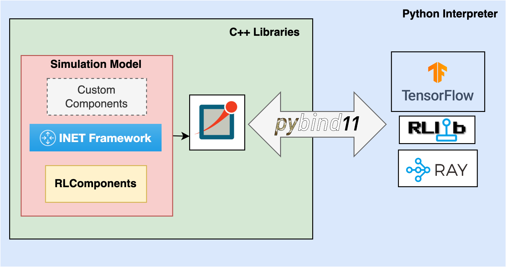

# RayNet - RL Training Platform for Network Protocols

## System overview

This repository contains the source code for the integration of Omnet++ and Ray/RLlib and some python scripts to facilitate the generation of interation experience between agents and networking environments. 

The system integrates C++ library and python libraries through pybindings. The figure below depicts the different packages/libraries used by RayNet:



Raynet requires the following third party (open-source) software:
- Omnet++
- Ray/RLlib
- Tensorflow or Pytorch

If you require to build TCP/IP simulation models, or reproduce the results of our RL driven congestion control policy, you'll also need:
- INET

## Dependencies


The project has been tested on Ubuntu 20.04, with Omnet++ v5.6.2, pybind11 v2.7.1.

## Installation instrutions

All C++ libraries mentioned below should be installed in the HOME directory if you want to use our building scripts off the shelf. Change the path references in the file accordingly otherwise. 

Download [Omnet++](https://omnetpp.org/download/) and install in home directory, following [these](https://doc.omnetpp.org/omnetpp/InstallGuide.pdf) instructions. 

Download [INET]() and install in home directory, following the instrusctions 

Clone this repository. 

## Create your custom model

The project should be able to handle any custom model. 

Implement your models using Omnet++ semantics, i.e. NED files with respective .h/.cc files, and put them in the `model` folder.

Compile the model into a shared library running `opp_makemake` and `make` from the `model` folder :

```
cd model
opp_makemake -o <custom_library_name> --make-so -M release 
make
```

## Build the binding module

Now we will use `cmake` to build the Python binding module. 

First, add your custom model into the CMakeLists.txt by editing the following line:

```
set(MY_LIB_LINK_LIBRARIES  -Wl,--no-as-needed <custom_library_name>)
```

Create a folder called `build` and run the following:

```
cd build
cmake ../
make
```

## Test the module
If you have built the module provided in this repo, then you can modify and run the `test.py` to test the newly created module:

```
python3 test.py
```

